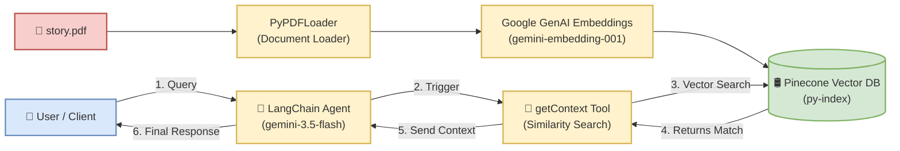

# Project Flow Diagram & Explanation

This repository contains a LangChain RAG (Retrieval-Augmented Generation) application that processes PDF documents, stores embeddings in Pinecone, and queries them using a Google Gemini-based Agent.

Below is the horizontal block flow diagram and a description of the project flow.

---

## 1. Project Flow Diagram (Horizontal Block Flow)

The following Mermaid diagram shows the flow of data and execution. It contains the **User (Actor)** and **story.pdf (Document)** symbols, displaying the process from left to right.

---

## 2. Diagram File (`diagram.drawio`)

A rich, editable Draw.io XML diagram has been created at [diagram.drawio](file:///d:/Data%20science%20course/12-Generative%20AI/project-9/diagram.drawio). 

It contains the horizontal block flow with native Draw.io icons for the **User Actor** and **PDF Document**.

To view or edit it:
1. Open [Draw.io](https://app.diagrams.net/) in your web browser.
2. Select **Open Existing Diagram** and open the [diagram.drawio](file:///d:/Data%20science%20course/12-Generative%20AI/project-9/diagram.drawio) file.

---

## 3. Project Components & Detailed Flow

The application performs two main workflows: **Document Ingestion** and **Agentic Querying**.

### A. Document Ingestion (Data Setup)
1. **Load PDF**: [main.py](file:///d:/Data%20science%20course/12-Generative%20AI/project-9/main.py) uses `PyPDFLoader` to read the local [story.pdf](file:///d:/Data%20science%20course/12-Generative%20AI/project-9/story.pdf) file and load it into a sequence of Document objects.
2. **Generate Embeddings**: Text content from the document is embedded into dense vectors using Google's `gemini-embedding-001` model.
3. **Store in Vector DB**: The embeddings are stored in a Pinecone index named `py-index`. Once stored, they can be searched semantically.

### B. Agentic Querying (RAG Loop)
1. **User Request**: The User sends a query (e.g., *"What was the first chapter of Harsh's story? and summarise it"*).
2. **LangChain Agent**: The agent uses the `gemini-3.5-flash` model. It evaluates the query and recognizes that it requires external knowledge from the PDF.
3. **Tool Activation**: The agent calls its custom tool, `getContext`.
4. **Similarity Search**: The `getContext` tool runs a similarity search on the Pinecone vector store, requesting the top $k=2$ most relevant segments.
5. **Context Retrieval**: Pinecone returns the text segments matching the semantic meaning of the user query.
6. **Response Generation**: The agent receives these passages, synthesizes the information, and generates a summary.
7. **User Delivery**: The final concise response is sent back to the User.
